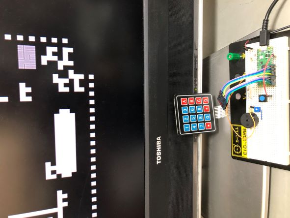
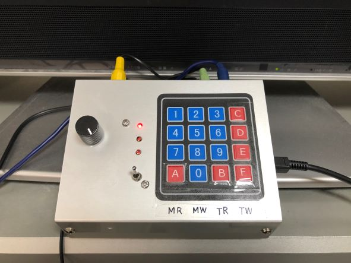
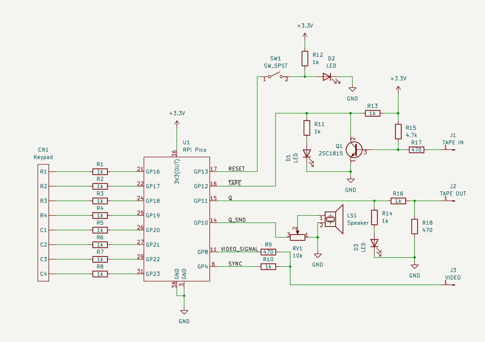
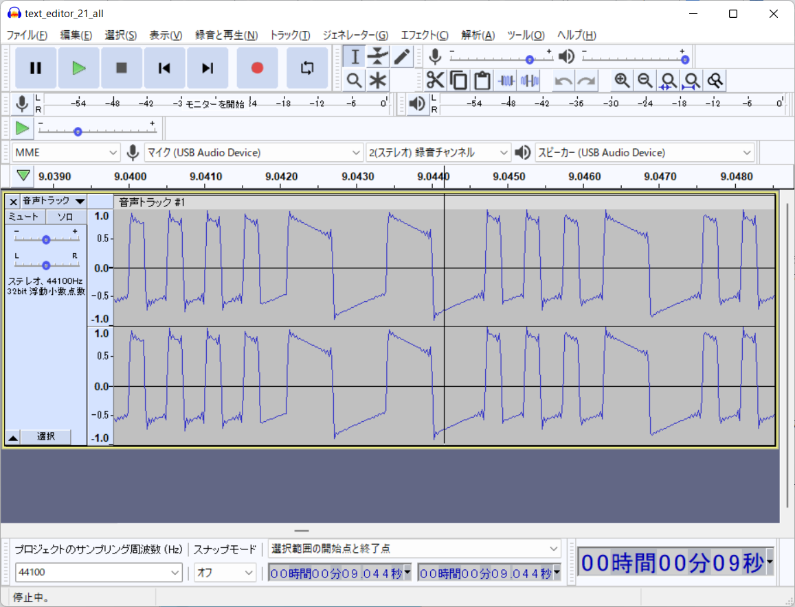

# VIP/Pico

[English](README_en.md)

Raspberry Pi Pico を用いた、COSMAC VIP のエミュレータ。

New!! [COSMAC VIP 上のソフトウェア](doc/software.md)

 

## 言い訳

まだいろいろ怪しいところがあります。
特に、ハードウェア部分に関しては、接続先を壊さないとは限りません。
「手元では動いている」ということはできます…

### 言い訳の詳細

- ビデオ信号のタイミングはあまりきっちりと組み立てていない
(タイマー割り込みが入ったらなるべく急いで処理する感じ)ため、
ときどき画面が乱れます。リセットすると大体直ります。
- ビデオ信号はノンインターレース 262 lines で、だいたい CDP1861 と似た
信号を出していると思います。
手元の TV では 1 秒に一回くらい微妙に震えています。
- テープレコーダーの入出力回路も、PC に USB オーディオ変換アダプタを通して
繋げるように試行錯誤した結果で、今一つこれでいいのかよくわかっていません。

## ハードウェア

はじめて描いた回路図なのでこれも怪しいです…

USB で給電しています。
とりあえず、VIDEO 出力の部分だけで最低限の動作確認はできるでしょう。

- VIDEO 出力と GND を RCA コネクタを通してテレビのビデオ端子につなぎます。
- Arduino 用に出回っているキーパッドをつなぎます。
(多分どれも同じだろうと思います。)
キー配置は COSMAC VIP の通りです。
- TAPE OUT, TAPE IN をテープレコーダーにつないでも記録できない可能性が高いでしょう
(ほぼデジタル信号として扱っているので)。
私は PC に USB オーディオ変換アダプタ
(https://www.elecom.co.jp/products/USB-AADC01BK.html)
で繋げています。
マイクはレベル 70 くらい、オーディオの補正オフ、AGC オフにして、
Audacity で録音。こんな感じ: 
「スピーカー」も補正オフ、レベル高め。

## ソフトウェア

build/pico_vip.uf2 を Raspberry Pi Pico に転送します。
最低限の動作確認用 ROM と、
[CosmacDriving](https://github.com/AutomaticComputer/CosmacDriving)を入れてあります。

"0" を押しながら起動(またはリセット)するとCosmacDriving が読み込まれ、実行されます。
"C" を押しながら起動するか、または起動時に 0000 番地に 0 以外のデータが書き込まれていなければ、
"VIP/Pico" と表示するだけのプログラムが実行されます。

RAM は 32KB としており、
Simple Sound Board 相当の音声発生ができます。

## VIP 用プログラムの転送

flash に ROM と RAM の内容を書き込めます。
ROM イメージは 512 バイト、RAM イメージは 4096 バイト固定です。

ROM には 下の "Instruction Manual" から "Operating System" 
を(適当なバイナリエディターで頑張って入力して)入れるといいでしょう。

- キーパッドの "F" を押しながら RESET/RUN スイッチを "RUN" に倒し、
端末アプリケーション(以下 Tera Term とする)を用いて USB でシリアル接続します。
- "h" で一応のヘルプが出ます。
- ROM への書き込みには、ターミナルで "r" を押し、
Tera Term のメニューから "ファイル→ファイル送信" で 512 バイトのバイナリファイルを指定し、
「バイナリ」をチェックして送信します。
8000 番地から書き込まれます。
- RAM への書き込みには、"0" から "b" のいずれかを押し、
4096 バイトのバイナリファイルを「バイナリ」で送信します。
0 番地から書き込まれます。
- RAM から PC への送信には、"d" を押した後、ログファイルを指定、
バイナリにチェックを入れて、ターミナル上でキーを押します。
(画面は乱れます。)
- 転送モードを終了するためには、電源を切る必要があります。
"Operating System" を開始するには "C" を押したまま、
RAM 上のプログラムを実行するには "0" から "B" までの数字を押したまま
RESET/RUN スイッチを "RUN" に倒します。

## COSMAC および COSMAC VIP について

COSMAC は 80 系や 68(65) 系と比べるとポピュラーになりませんでしたが、
いろいろと面白い物語のある CPU です。

開発者の Joe Weisbecker さん、
その娘さんで「世界初の女性 indie game developer」Joyce さん、等については、
そのうち少し書いてみたいと思っています。

### リンク

[COSMAC 研究会(かんぱぱさん)](https://kanpapa.com/cosmac/)
COSMAC に興味のある方は既にご存じと思いますが、
現物の CDP1802 を用いたハードウェアなど、
充実した情報があります。

[COSMAC](http://www.st.rim.or.jp/~nkomatsu/miscproc/CDP1802.html)
COSMAC は、8080 や 6800 を基準にするとかなり変わったアーキテクチャと言えます。
こちらにその様子が書かれています。

[Emma 02](https://www.emma02.hobby-site.com/)
CDP1802 (等)を用いた様々なシステムのエミュレーターです。
COSMAC の原型となった FRED なども試せます。

#### Hagley Digital Archives

Hagley Museum の Digital Archives で、
RCA から寄贈を受けた資料がたくさん公開されています。

- [COSMAC VIP Instruction Manual](https://digital.hagley.org/LMSS_246409_873_11)
"Operating System" や CHIP-8 に加え、20 本のプログラムも載っています。
- [COSMAC VIP Game Manual](https://digital.hagley.org/LMSS_246409_873_12)
- [COSMAC VIP Game Manual II](https://digital.hagley.org/MSS_246477_MA1210_011)

#### 雑誌等

- [VIPER](https://github.com/mattmikolay/viper) 
COSMAC VIP 専門の雑誌です。
- [PIPs for VIPS](https://github.com/TomSwan/pips-for-vips)
Tom Swan 氏による「かなり印象的なプログラム集」で、
VIP でのプログラミングの解説書という感じもあります。
- [COSMAC Elf 関連の雑誌](http://www.cosmacelf.com/publications/newsletters/)
VIP ではありませんが、COSMAC 関連。
"Newsletters" に限らず、いろいろ情報があります。

## COSMAC VIP 上のソフトウェア

[COSMAC VIP 上のソフトウェア](doc/software.md)

## 変更

2022.8.27 "COSMAC VIP 上のソフトウェア" 追加。
start_display(), stop_display() を修正。

2022.9.11 
メモリーアドレスの変換(READ/WRITE による変更など)について修正。
"COSMAC VIP 上のソフトウェア" に Color Kaleidoscope などについて追記。

2022.10.16 
前回のメモリーアドレスの変換の修正がおかしかったので、再修正。
"COSMAC VIP 上のソフトウェア" に、VIP Animal Race, VIP Round Up について追記。

2022.12.30
サンプルプログラム(CosmacDriving)を追加。

## 謝辞

ビデオ信号については、主に Arduino の [TVout](https://github.com/Avamander/arduino-tvout)
で学びました
(今回コードを直接使っているわけではありませんが)。
