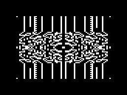

# COSMAC VIP 上のソフトウェア

Instruction manual, Game manual(I, II), VIPER, PIPS for VIPs などに
掲載のソフトウェアについて、実行方法、修正点などを書いておきます。

## Emma 02 での実行


VIP のプログラムを試すのに手軽なのは、Emma 02 でしょう。
ただし、エミュレートする機種も多く多機能なため、
わかりづらい点もあるかと思うので、少し説明しておきます。

まず、[Emma 02 のページ](https://www.emma02.hobby-site.com/)
からダウンロードしてインストールします。

"RCA" のタブで "Cosmac VIP" を選びます。

Key Map ボタンからキーマップを変更しておくとゲームなどには便利でしょう。
私は "on Location" の "Set 1" にしているのですが、正確にはどうやるのか忘れました…
通常のキーボードの左 4 列 1234, qwer, asdf, zxcv が
VIP の Hex key の 123c, 456d, 789e, a0bf に変換されます。

On board RAM は 4KB にしておくと大体大丈夫です。

ROM には vip.rom または vip.32.rom を指定しておきます。
大抵はどちらでも大丈夫です。

CHIP-8 のプログラムの場合は、RAM に chip8.ram を、
CHIP-8/X/10 に CHIP-8 で書かれたプログラムを指定します。
(CHIP-8 本体と CHIP-8 で書かれたプログラムを合わせたバイナリを
RAM に読み込むことも可能です。)

Start ボタンで起動します。

最初にメッセージボックスで表示されますが、モニターに入りたい場合には、
"C"(にあたるキー)を押しながら、F12 を二回押します
(RESET→RUN に相当します)。

## VIP の起動・プログラムの終了

単に起動すると、8000 番地からの ROM のコードが実行されますが、
"C" が押されていなければ 0 番地からのコードが実行されます。
CHIP-8 を RAM に入れてあれば、これが実行され、
CHIP-8 プログラムを解釈してゆきます。

起動時に "C" が押されていればモニターが起動します。

モニターやプログラムを終わらせるには、
単に RESET→RUN(Emma 02 なら F12 を二回)したり電源を切ったりします。
リセットしても RAM の内容は残っています。


## VIP Kaleidoscope

Kaleidoscope という名前のプログラム群があります。
何らかの方法で点をいくつか決めて、
上下・左右対称(ものによってはx=y, x=-y に関しても対称)にして模様を生成する、というものです。
Life game 等と比べると単純ですが、初期の generative art と言えるでしょうか。

まずは、VIP Instruction manual にある Kaleidoscope です。
以下の画像はいずれも Emma 02 の screendump です。


Emma 02 では、ROM に vip.rom または vip.32.rom, RAM に chip8.ram を指定して、
CHIP-8/X/10 ボタンから
"Kaleidoscope \[Joseph Weisbecker, 1978\].ch8"
または "Kaleidoscope \[Joseph Weisbecker, 1978\].hex"
を選択します。

2, 4, 6, 8 で点を動かして、0 で描画を始めます。
Instruction manual にある "44444442220" という組み合わせなどは、見ていて飽きません。

VIPER vol. 1 issue 10 の "Fascinating Kaleidoscope" (Phil Sumner)に、
興味深い組み合わせが集められています(次の変更を必要とするものが多くあります。)。


### VIP Kaleidoscope modification 

VIPER vol. 1 issue 9 の "VIP game improvements" (Phil Sumner)にある、
VIP Kaleidoscope の改良版です。


1, 3, 5, 7 キーによる斜めの動き、F による描画の一時停止、
A によるリセット機能が追加されています。

入力には、VIP Kaleidoscope を読み込んだ後、
C を押しながらリセットしてモニタを起動、
後は instruction manual に従い変更部分を入力してゆきます。
(以下、VIPER 1.9 p.13 に従います。)
"03000"と入力して 0300 番地から入力を開始(最後の 0 は Memory Write の命令)、
"400113204003..." と入力していきます。
0313 番地まで入力したら、
C を押しながらリセット、
"03200" と入力して 0300 番地から入力を開始… のように続けます。

入力が終わっ(て保存し)たら、リセットし、実行します。

### Color Kaleidoscope

VIPER vol. 2 issue 1 "An adaptation of Phil Sumner's improved VIP Kaleidoscope" (Bob Hayes)
にあるものですが、試していません。	


### Wacko Kaleidoscope

VIPER vol. 2 issue 5 "Modifications to kaleidoscope"  (Charles R. Williams)にある、
VIP Kaleidoscope の改変版です。
妙な動きをします。



CHIP-8 の 2 page 版(縦の解像度が二倍になる)が必要で、
まず VIPER 1.3 p.10 の変更を施した CHIP-8 を用意し、
VIP Kaleidoscope を 260 番地から読み込んで、変更を入力します。

vip.32.rom ではうまく動作しないようです。


## 8 sector, 2 page kaleidoscope

VIPER vol. 2 issue 6 "8 sector, 2 page kaleidoscope" (George Ziniewicz)にある、
VIP Kaleidoscope とは独立のプログラムで、
2 page 版 CHIP-8 上で動作します。
vip.32.rom ではうまく動作しないようです。
(2 page 版 CHIP-8 自体がそうなのかもしれません。)

点の動きを CHIP-8 プログラムのサブルーチンとして書く、というもので、
いくつかの例が挙げられています。


入力には注意が必要です(VIPER の後の号に修正があるのかもしれませんが、発見できませんでした)。
VIPER 1.3 の 2 page 版 CHIP-8 を準備し、0200-0201 番地を 1300 に変更します。
また、記事中に、00AC 番地を EC に変更すると書いてあります。
記事の通りのコード(03A0 からのサブルーチンはどれかを選ぶ)に加え、
03F0 番地に 80 を入れておくものと思われます。

## Ipso Facto 26 の Kaleidoscope

Ipso Facto 26 (Dec. 1982)の p. 14, Kaleidoscope (V. G. Cayer). 
Elf 用ということになっていると思いますが、
Ipso Facto 28 の p. 6 に修正があり、
そこにある「Elf II用」の変更を行うと
VIP でも動きます(ただし、Elf では hex display を表示していますが
これは見られません)。


作者が "kaleidoscope, crazy blanket or whatever" と書いている通り、
絨毯のような模様が展開されます。


## Ipso Facto 28 の Kaleidoscopic Life

Ipso Facto 28 (Mar. 1983)の p. 18, Kaleidoscope and Life program for the 1802/1861(J. Munck). 

これは変わり種で、ランダムに生成した点を対称に描画する Kaleidoscope の部分と、
その出力をもとに Life game を実行する部分を切り替えることができるものです。


VIP 用の変更点は以下の通り。

```
0030 E2 
0030 F8 00 52 62 22 69 30 91 F8 0F 52 9F 30 9F F8 00
0040 A0 B0 D0
008F 30 2F
009D 30 38
00C9 3E
00CB 36
00D4 3E
00D6 36
00D8 61 22 30 3E XX(don't care)
```

ただし、Kaleidoscope の幅(マスク)を変更する機能は省いています。
0039 番地の値を変更すると同様のことができます。
また、Life game で Q flip-flop を計算に使用しているため、ブツブツと音が鳴ります。
切り替えは "0" ボタンです。
